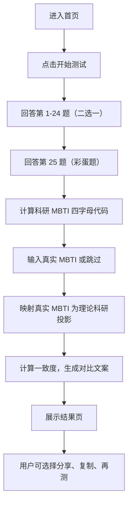

## 1. 产品概述

一个娱乐向科研人格测试产品，通过 25 道二选一题目测出用户的「科研 MBTI」四字母代码，再和用户真实 16 型 MBTI 对比，生成一份抽象、搞笑但又有点准的科研人格报告。目标用户为科研人群（研究生、博士后、青年教师等），核心价值是「让科研人看到结果时觉得离谱但怎么有点像我」，适合截图传播。

## 2. 核心功能

### 2.1 用户角色

| 角色 | 说明 |
|------|------|
| 普通用户 | 无需注册，直接进入测试，结果保存在 localStorage |

### 2.2 功能模块

1. **首页**：标题、副标题、CTA 按钮、免责声明
2. **测试页**：25 题二选一问答，进度条，自动跳转
3. **MBTI 输入页**：输入真实 MBTI 或跳过
4. **结果页**：科研 MBTI 结果、核心描述、超能力、副作用、生存建议、真实 MBTI 对比、一致度、分享功能

### 2.3 页面详情

| 页面名称 | 模块名称 | 功能描述 |
|----------|----------|----------|
| 首页 | Hero 区 | 标题"测测你的科研 MBTI"，副标题，CTA 按钮"开始测试"，免责声明 |
| 首页 | 背景动画 | 赛博科研风动态背景，浮动元素（PDF、咖啡、组会、deadline 等图标） |
| 测试页 | 进度条 | 显示当前题号 / 总题数，带动画过渡 |
| 测试页 | 题目卡片 | 题目文字 + 两个选项按钮，选择后自动跳下一题，支持上一题回退 |
| 测试页 | 彩蛋题 | 第 25 题为不参与主计分的彩蛋题，四选一 |
| MBTI 输入页 | 维度选择 | 四组维度选择器（I/E、N/S、T/F、J/P）或 16 按钮直选，支持跳过 |
| 结果页 | 科研人格标题 | 大标题展示四字母代码 + 人格名称 + 副标题 |
| 结果页 | 核心描述 | 一段人格描述文案 |
| 结果页 | 科研超能力 | 列表展示 3-4 条优势 |
| 结果页 | 科研副作用 | 列表展示 3-4 条问题 |
| 结果页 | 生存建议 | 列表展示 3-4 条建议 |
| 结果页 | MBTI 对比区 | 真实 MBTI vs 科研 MBTI 对比，维度差异文案，一致度展示 |
| 结果页 | 分享按钮 | 复制结果、生成海报、再测一次 |

## 3. 核心流程



## 4. 用户界面设计

### 4.1 设计风格

- **主色调**：深色背景（#0a0a0f 接近纯黑），荧光绿（#00ff88）作为主强调色，紫色（#a855f7）和蓝色（#3b82f6）作为辅助强调色
- **按钮风格**：圆角矩形，hover 时有发光效果（box-shadow glow），选中态有明显边框光晕
- **字体**：标题使用有科技感的等宽/几何字体，正文使用清晰易读的无衬线字体
- **布局风格**：卡片式布局，居中单列，适合移动端阅读
- **图标/装饰**：使用 emoji 和 SVG 图标，配合赛博科研主题（烧瓶、显微镜、代码符号、PDF 图标等）
- **背景**：深色底 + 粒子/网格线动画 + 随机浮动科研相关图标

### 4.2 页面设计概述

| 页面名称 | 模块名称 | UI 元素 |
|----------|----------|---------|
| 首页 | Hero 区 | 大标题居中，渐变色文字，副标题灰色小字，CTA 按钮荧光绿，底部免责声明小字灰色 |
| 首页 | 背景动画 | Canvas 粒子网格 + 浮动科研图标（慢速漂移），半透明效果 |
| 测试页 | 进度条 | 顶部细长进度条，渐变色填充，右侧显示题号文字 |
| 测试页 | 题目卡片 | 玻璃态卡片（backdrop-blur），题目文字白色，两个选项按钮纵向排列，选中态发光 |
| 测试页 | 导航按钮 | 底部"上一题"灰色按钮 |
| MBTI 输入页 | 维度选择器 | 四组切换按钮，每组两个选项，选中态高亮 |
| MBTI 输入页 | 跳过按钮 | 底部灰色文字链接 |
| 结果页 | 人格标题 | 大号四字母代码（荧光绿），人格名称，副标题 |
| 结果页 | 内容卡片 | 多个玻璃态卡片，每个卡片一个模块（描述、超能力、副作用、建议、对比） |
| 结果页 | 一致度条 | 进度条样式，显示匹配数/4，带标签 |
| 结果页 | 分享按钮 | 底部固定栏，三个操作按钮 |

### 4.3 响应式设计

- 桌面端优先设计，最大内容宽度 640px 居中
- 移动端：卡片全宽，按钮加大触摸区域（最小 44px 高度），字体适当缩小
- 平板端：与桌面端基本一致，适当调整间距
- 触摸优化：选项按钮间距足够，防止误触

## 5. 科研 MBTI 四个维度

| 维度 | 字母 | 名称 | 描述 | 对应真实 MBTI |
|------|------|------|------|--------------|
| 科研能量来源 | **L** | Lone 潜水闭关型 | 喜欢一个人想清楚再说，科研状态靠独处充电 | I |
| | **C** | Collaborative 组会合体型 | 靠讨论、互怼、群聊、组会激活科研脑细胞 | E |
| 选题风格 | **N** | Novel 脑洞开坑型 | 喜欢新概念、新问题、新方向，容易开坑 | N |
| | **A** | Archive 文献考古型 | 喜欢沿着已有脉络推进，把前人的坑填完整 | S |
| 推进方式 | **M** | Model 模型搭架型 | 先想框架、机制、假设、变量关系 | T |
| | **X** | eXperiment 炼丹试错型 | 先跑实验、先调参数、先搞个结果看看 | F |
| 时间管理 | **O** | Organized 早鸟排版型 | 提前规划、文件命名规范、ddl 前就想封版 | J |
| | **B** | Burst 截稿变身型 | 平时缓慢孵化，ddl 前一夜进化成论文赛博战士 | P |

## 6. 十六种科研人格

| 代码 | 科研人格名 | 副标题 | 简介 |
|------|-----------|--------|------|
| LNMO | 月球基地总设计师 | 你的大脑是一个私人 NASA 发射中心 | 一个人在脑内建完整宇宙，开题时像 NASA 项目汇报。 |
| LNMB | 凌晨三点宇宙建筑师 | 白天的沉默是为了凌晨的爆发 | 白天沉默，凌晨突然悟道，把理论框架画到第八层。 |
| LNXO | 低温脑洞实验员 | 安静但疯狂，编号即正义 | 安静但疯狂，能独自设计一堆奇怪实验，还会认真编号。 |
| LNXB | 孤独炼丹爆破手 | 不解释，直接跑；不预告，直接炸 | 不说话，直接跑；不解释，直接炸；ddl 前靠玄学出图。 |
| LAMO | 文献地层测绘员 | 把文献史读成地层剖面图 | 像考古学家一样梳理文献，把领域历史挖得明明白白。 |
| LAMB | 考古式 Deadline 守夜人 | PDF 堆里的沉默复活者 | 平时深潜文献海，截稿前突然从 PDF 堆里复活。 |
| LAXO | 静音复现实验仙人 | 稳定得像实验室地基 | 最擅长默默复现、修 bug、清数据，稳定得像实验室地基。 |
| LAXB | 补实验洞穴兽 | 平时不见，最后三天疯狂补 | 平时不见人影，最后三天疯狂补实验，嘴里念着"应该够了"。 |
| CNMO | 组会概念产品经理 | 自带激光笔气场的路线图绘制者 | 擅长把抽象脑洞包装成路线图，组会上自带激光笔气场。 |
| CNMB | PPT 宇宙煽动家 | 还没做完就开始改变世界 | 还没做完，但已经能讲出改变世界的版本。 |
| CNXO | 联机炼丹工头 | 群聊变流水线，讨论变生产力 | 一边讨论一边试错，能把群聊变成实验流水线。 |
| CNXB | 群聊爆改火箭队长 | 在 deadline 前组织发射任务 | ddl 前拉起所有人冲刺，一边崩溃一边带队起飞。 |
| CAMO | 合作型谱系管理员 | 文献、任务、时间表排得像族谱 | 擅长把文献、任务、作者贡献和时间表排得像族谱。 |
| CAMB | 组会后临时考古队 | 每次组会都是新考古的起点 | 每次组会后才意识到还有十篇必须读，然后火速考古。 |
| CAXO | 多人复现流水线厂长 | 稳、准、会协作的项目拆解大师 | 稳、准、会协作，能把项目拆成每个人都能做的小零件。 |
| CAXB | 众筹补实验指挥官 | 截稿前的摇人总动员 | 最擅长截稿前摇人、补图、补表、补代码，场面极其科研。 |

## 7. 测试题设计（共 25 题）

### 维度 L / C：科研能量来源（题 1-6）

| 题号 | 问题 | A（计 L） | B（计 C） |
|------|------|-----------|-----------|
| 1 | 导师突然抛出一个新选题，你第一反应是？ | 回去自己先想三天 | 立刻找人 brainstorm |
| 2 | 代码或实验卡住时，你更可能？ | 深夜独自搜索解决方案 | 直接在群里发截图求救 |
| 3 | 写论文时你需要？ | 关掉消息，进入孤岛模式 | 开共享文档，边聊边改 |
| 4 | 你的好点子通常来自？ | 散步、洗澡、发呆 | 聊天、组会、被人质疑 |
| 5 | 看到合作者改了你的段落，你会？ | 先沉默消化半小时 | 马上连麦开始解释 |
| 6 | 科研压力大时，你通常？ | 隐身，自己慢慢修复 | 找同门吐槽恢复血量 |

### 维度 N / A：选题风格（题 7-12）

| 题号 | 问题 | A（计 N） | B（计 A） |
|------|------|-----------|-----------|
| 7 | 你更喜欢哪种选题？ | 没什么人做过的新问题 | 前人做过但还能推进的问题 |
| 8 | 看到一个冷门现象，你会？ | 想给它起一个新概念 | 先查有没有前人定义过 |
| 9 | 开题时你更想强调？ | 这个问题为什么新 | 这个问题如何接续已有研究 |
| 10 | 读文献时你最兴奋的是？ | 发现一个没人填的坑 | 看清一个领域的演化脉络 |
| 11 | 被问"创新点在哪"时，你会？ | 激动描述未来可能性 | 严谨解释和前人的差异 |
| 12 | 你理想中的论文贡献是？ | 开辟一个新方向 | 把一个老问题讲清楚 |

### 维度 M / X：推进方式（题 13-18）

| 题号 | 问题 | A（计 M） | B（计 X） |
|------|------|-----------|-----------|
| 13 | 遇到新问题，你通常先？ | 画框架、列变量、想机制 | 先跑个 demo 或 pilot |
| 14 | 方法不稳定时，你倾向于？ | 回到理论逻辑重新推 | 改参数、换数据、继续试 |
| 15 | 开始实验或写代码前，你需要？ | 一个相对完整的方案 | 一个能跑起来的最小版本 |
| 16 | Reviewer 质疑你时，你更想补？ | 理论解释和逻辑链 | 实验结果和对比图 |
| 17 | 哪种结果更让你安心？ | 机制解释闭环 | 曲线明显变好 |
| 18 | 学一个新工具时，你会？ | 先看文档和原理 | 直接复制 demo 改起来 |

### 维度 O / B：时间管理方式（题 19-24）

| 题号 | 问题 | A（计 O） | B（计 B） |
|------|------|-----------|-----------|
| 19 | 距离 deadline 还有一个月，你会？ | 排时间表，拆任务 | 先让灵感自然发酵 |
| 20 | 写论文时，你更常？ | 边做边整理材料 | 最后统一考古所有文件 |
| 21 | 你的文件命名更像？ | `fig3_final_clean_v1` | `final_final_really_final2` |
| 22 | 周末科研安排通常是？ | 有固定进度 | 看危机程度决定 |
| 23 | 数据和图表你会？ | 边跑边归档 | 投稿前疯狂抢救 |
| 24 | 合作任务快到期时，你会？ | 提前提醒大家 | 最后一天爆发神迹 |

### 彩蛋题：第 25 题（不参与主计分）

| 选项 | 文字 | 标签 |
|------|------|------|
| A | 我觉得还能再改一点 | 永恒修改鬼 |
| B | 先交了再说 | 投稿冲锋兵 |
| C | 我想开个新坑 | 开坑异能者 |
| D | 谁来救救我的代码 / 实验 | Debug 受害者 |

## 8. 评分逻辑

### 8.1 基础计分

每个维度单独计分，初始 scores = { L:0, C:0, N:0, A:0, M:0, X:0, O:0, B:0 }。用户每选择一个选项，给对应字母 +1。

最终科研类型：

```js
dim1 = scores.L >= scores.C ? "L" : "C"
dim2 = scores.N >= scores.A ? "N" : "A"
dim3 = scores.M >= scores.X ? "M" : "X"
dim4 = scores.O >= scores.B ? "O" : "B"
researchType = dim1 + dim2 + dim3 + dim4
```

### 8.2 平局处理

如果某个维度打平：
1. 优先看用户第 25 题彩蛋倾向辅助判断
2. 或根据真实 MBTI 辅助判断
3. 或直接给混合描述，如「你在 L 和 C 之间反复横跳，是典型的'平时社恐，组会开麦'型科研人」

## 9. 真实 MBTI 对比

### 9.1 映射规则

| 真实 MBTI 维度 | 科研 MBTI 维度 |
|---------------|---------------|
| I → L | E → C |
| N → N | S → A |
| T → M | F → X |
| J → O | P → B |

### 9.2 一致度等级

| 匹配数量 | 等级名称 |
|----------|----------|
| 4/4 | 灵魂同构型 |
| 3/4 | 主线一致型 |
| 2/4 | 双系统运行型 |
| 1/4 | 反差萌科研人 |
| 0/4 | 科研人格被邪神接管型 |

### 9.3 真实 16 型 MBTI 底色标签

| MBTI | 底色标签 | MBTI | 底色标签 |
|------|----------|------|----------|
| INTJ | 战略黑箱 | INTP | 概念洞穴人 |
| ENTJ | 项目总控王 | ENTP | 开题永动机 |
| INFJ | 意义炼金师 | INFP | 灵魂开坑人 |
| ENFJ | 组会牧师 | ENFP | 灵感烟花筒 |
| ISTJ | 表格守门员 | ISFJ | 后勤菩萨 |
| ESTJ | 进度巡检官 | ESFJ | 协作润滑剂 |
| ISTP | 工具拆解侠 | ISFP | 审美实验员 |
| ESTP | 现场救火队 | ESFP | 氛围数据员 |

### 9.4 维度差异文案

**I/E vs L/C：**

| 情况 | 文案 |
|------|------|
| I → C | 生活里你是内向人，科研里你被迫开麦。组会是你的临时外向药。 |
| E → L | 生活里你很外向，但科研时你选择闭关。说明你的社交电池不想献给论文。 |
| I → L | 你的生活和科研都需要独处充电，别打扰你，你正在和宇宙变量对话。 |
| E → C | 你是真正的讨论型科研人，越聊越清醒，越开会越来电。 |

**N/S vs N/A：**

| 情况 | 文案 |
|------|------|
| N → A | 生活里你爱想象，科研里却变成考古学家。你把浪漫藏起来，把引用格式摆上台面。 |
| S → N | 生活里你务实，科研里突然发疯开坑。可能是论文把你的隐藏脑洞逼出来了。 |
| N → N | 你的人生和科研都离不开脑洞，唯一的问题是：坑太多，命太短。 |
| S → A | 你是稳定推进型选手，别人负责上天，你负责确认梯子是否合规。 |

**T/F vs M/X：**

| 情况 | 文案 |
|------|------|
| T → X | 生活里你讲逻辑，科研里却开始炼丹。说明实验结果已经把你教育得很彻底。 |
| F → M | 生活里你重视感受，科研里你冷静搭模型。你把温柔留给人类，把严谨留给论文。 |
| T → M | 你是逻辑闭环爱好者，没有机制解释的结果在你眼里都像玄学。 |
| F → X | 你相信反馈、现象和真实反应。先让结果说话，再让理论补票。 |

**J/P vs O/B：**

| 情况 | 文案 |
|------|------|
| J → B | 生活中你想规划，科研中你被 deadline 夺舍。不是你不自律，是论文太会拖。 |
| P → O | 生活里你随缘，科研里却开始建表。说明你不是不会规划，你只是需要足够恐惧。 |
| J → O | 你是时间线守护者，连 figure 命名都透露着秩序之光。 |
| P → B | 你和 deadline 是宿命伴侣。不到最后一刻，你的科研人格不会完全加载。 |

## 10. 本地存储

- 用户答案：`localStorage` 存储当前进度
- 测试结果：`localStorage` 存储最近一次结果
- 支持断点续答