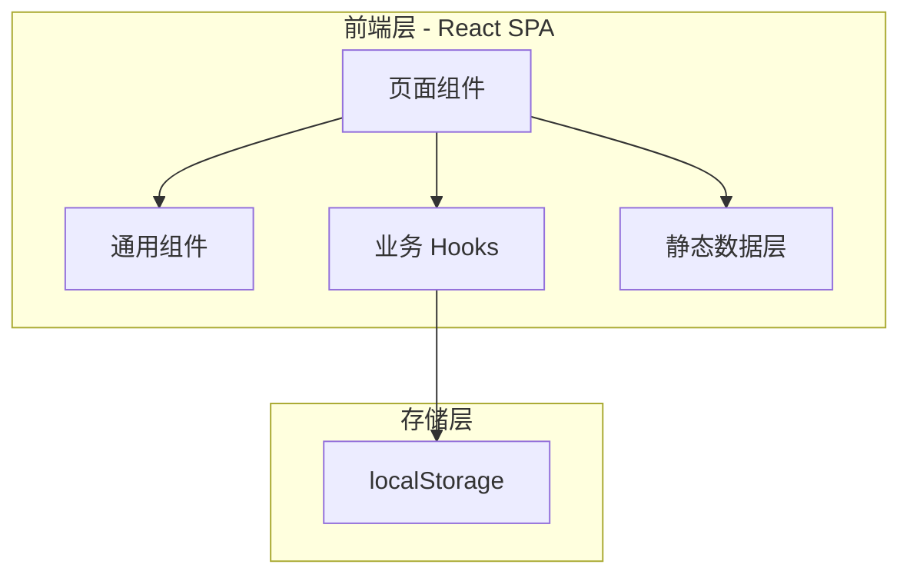

## 1. 架构设计



纯前端 SPA 架构，无后端服务。所有数据（题库、人格描述、映射规则）内嵌为静态 JSON 数据，用户答案和结果存储在 localStorage。

## 2. 技术描述

- **前端框架**：React 18 + TypeScript
- **构建工具**：Vite 5
- **样式方案**：Tailwind CSS 3 + CSS 变量
- **动效**：Framer Motion
- **路由**：React Router v6（4 个页面路由）
- **海报生成**：html-to-image
- **图标**：Lucide React
- **后端**：无（纯前端 MVP）

## 3. 路由定义

| 路由 | 页面 | 说明 |
|------|------|------|
| `/` | 首页 | Landing page，CTA 进入测试 |
| `/test` | 测试页 | 25 道题问答 |
| `/mbti-input` | MBTI 输入页 | 输入真实 MBTI 或跳过 |
| `/result` | 结果页 | 展示科研人格报告 |

## 4. 数据模型

### 4.1 题目数据

```typescript
interface Question {
  id: number;
  text: string;
  options: {
    text: string;
    score: string; // 维度字母: L/C/N/A/M/X/O/B
  }[];
  // 彩蛋题 special: true
  special?: boolean;
}
```

### 4.2 人格数据

```typescript
interface Persona {
  code: string;        // 四字母代码
  name: string;        // 人格名称
  subtitle: string;    // 副标题
  description: string; // 核心描述
  superpowers: string[];
  risks: string[];
  advice: string[];
}
```

### 4.3 MBTI 映射

```typescript
interface MBTIMapping {
  mbti: string;     // 真实 MBTI 类型
  tag: string;      // 底色标签
  label: string;    // 中文标签
}

// 维度映射规则
const DIM_MAP: Record<string, string> = {
  I: "L", E: "C", N: "N", S: "A",
  T: "M", F: "X", J: "O", P: "B"
};
```

### 4.4 一致度等级

```typescript
interface MatchLevel {
  matches: number;
  label: string;
}
```

### 4.5 维度差异文案

```typescript
interface DimensionDiff {
  realDim: string;  // 真实 MBTI 该维度
  researchDim: string; // 科研 MBTI 该维度
  text: string;     // 解释文案
}
```

### 4.6 localStorage 键值

| 键名 | 类型 | 说明 |
|------|------|------|
| `research_mbti_answers` | `Record<number, string>` | 当前答案 {题号: 选项字母} |
| `research_mbti_result` | `{ code, persona, mbti, matchLevel }` | 最近一次结果 |
| `research_mbti_current_q` | `number` | 当前题目序号 |

## 5. 组件树

```
App
├── HomePage
│   └── ParticleBackground (Canvas 粒子背景)
├── TestPage
│   ├── ProgressBar
│   ├── QuestionCard
│   │   └── OptionButton (×2 或 ×4)
│   └── NavButtons (上一题)
├── MBTIInputPage
│   ├── DimensionSelector (×4 组)
│   └── SkipButton
└── ResultPage
    ├── PersonaHeader
    ├── DescriptionCard
    ├── SuperpowersCard
    ├── RisksCard
    ├── AdviceCard
    ├── MBTICompareCard
    ├── MatchLevelBar
    └── ShareButtons
```

## 6. 状态管理

使用 React Context + useReducer 管理全局测试状态：

```typescript
interface TestState {
  currentStep: 'home' | 'test' | 'mbti-input' | 'result';
  currentQuestion: number;
  answers: Record<number, string>;
  scores: Record<string, number>;
  researchType: string;
  realMBTI: string;
  matchLevel: number;
}
```

## 7. 构建与部署

- 开发：`npm run dev`
- 构建：`npm run build` → `dist/` 静态文件
- 部署：可部署到任意静态托管（Vercel、Netlify、GitHub Pages）